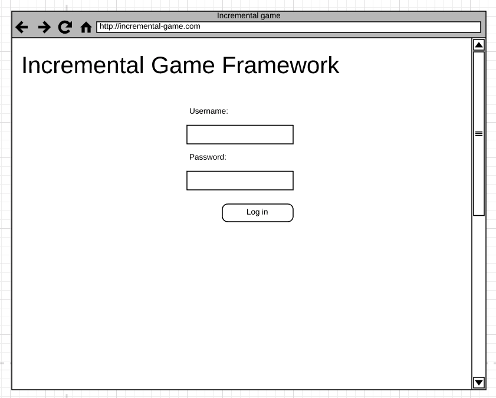

# Homework 2

## Deliverables

* Single txt file containing link to **the pull request** and **CS3 application**

Pull request should at least containing the following changed files:

* AuthenticationServlet.java
* AdminGeneratorsServlet.java
* GeneratorsDAOImpl.java
* UsersDAOImpl.java
* app.css

## Descriptions

In this lab, we will pick up what we implemented back in exercise-2 with the
proper backend functionality. To get started with, we will implement the generators
configuration page like below:

And your mission is to create Java Servlets that:

* Display the pages as above
* Handle user authentication using Session
* Handle the necessary persistence about generators information

## Get Started

You should continue your code from lab 4 before except download additional two
files under homework 2 release:
https://github.com/rcliao/cookie-clicker/releases/tag/hw2-5

The few files are:
* `src/main/java/edu/csula/web/servlet/AuthenticationServlet.java`
* `src/main/java/edu/csula/models/Generator.java`
* `src/main/java/edu/csula/models/User.java`
* `src/main/java/edu/csula/storage/UsersDAO.java`
* `src/main/java/edu/csula/storage/servlet/UsersDAOImpl.java`
* `src/test/java/edu/csula/storage/servlet/GeneratorsDAOImplTest.java`
* `src/test/java/edu/csula/storage/servlet/UsersDAOImplTest.java`

Once download these two files, add those files to be under where your lab 4 was.

And you are ready to start. Use `./gradlew check` to find all the failing tests
and modify `GeneratorsDAOImpl.java` to fix the unit test.

## Requirements

### Functional

* User shall login first prior to make any changes under `Admin*Servlet.java`
* Should allow only `admin:cs3220password` user to login
* If user is not currently login and go to other pages, they should be _redirected_ back to the login page
* User should be able to create event passing generator name, description, rate, base cost and unlock value
* User should be able to see a list of generators
* User should be able to modify a single generator

### Technical

* Application needs to be deployed to CS3 server
* Application should store user authentication under session scope
* Application should store the generator information in application scope
* Application should display HTML with proper CSS (similar to what you have accomplished in exercise-2)
* Should pass all the unit tests from `./gradlew check`
